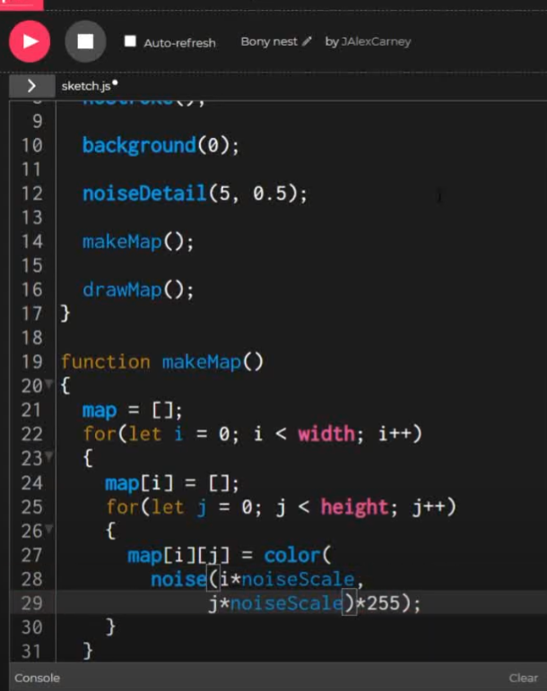
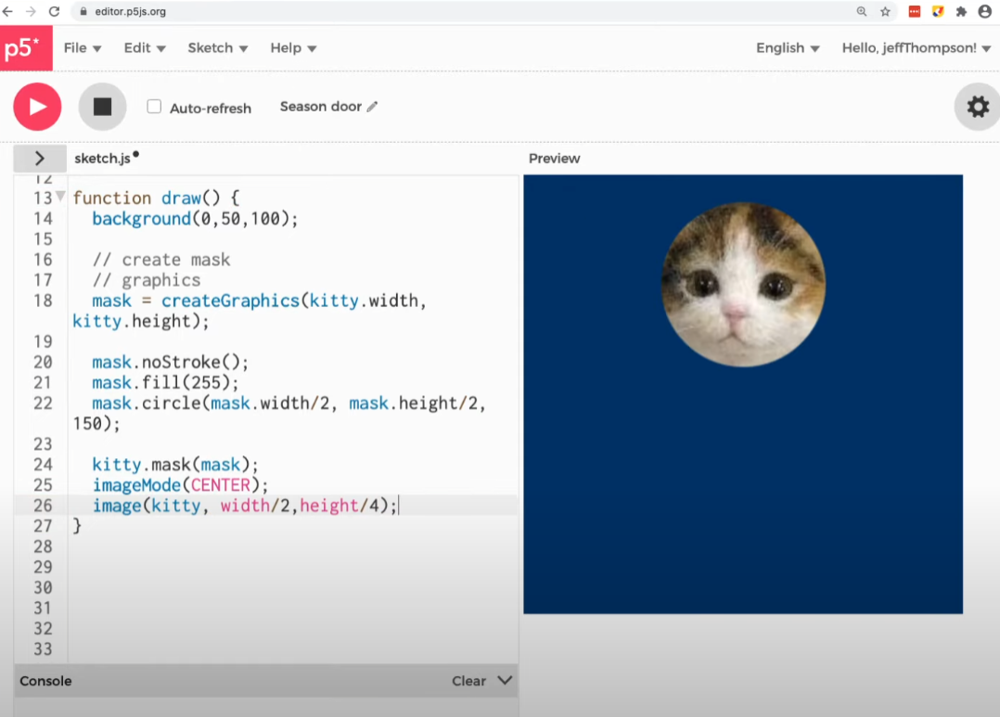
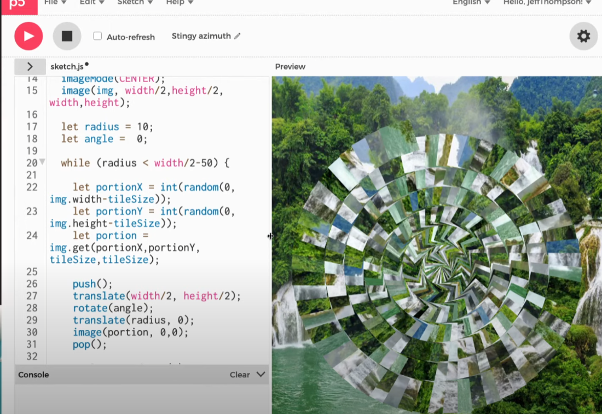

# Quiz-Week-8

# Part 1: Imaging Technique Inspiration

I was super excited when watching *Spider-Man: Across the Spider-Verse*, especially scenes with the punk spider-man. The creators applied collage effect and layered up different pieces which turn the whole image to a comic collage.

I would love to try out comic collage effects with codes while we have already been introduced to turning our images into pixels. I would further research possible ways to turn our image into pieces. I also wish to utilize random generation and the pixels of the image into a pixel art animation in conjunction with a collage effect that boosts the contrast of different components of the image.

## Part 2: Coding Technique Exploration

Perlin noise in p5.js is the first function I landed on while researching. It is a common function for generative art. Most of the artworks consist of strands of lines following a flow.

Further to create my pixel artwork, I would need noise function in addition to pixel color picker that we learnt in class. When playing with the noise map scale, I'll be able to get different detail of the noise that I want. 

For creating the collage pieces, we could use mask function to draw a shape with image inside. 

Also learning from Jeff Thompson's video, I could extract portion of an image and making pieces out of it with translation.

